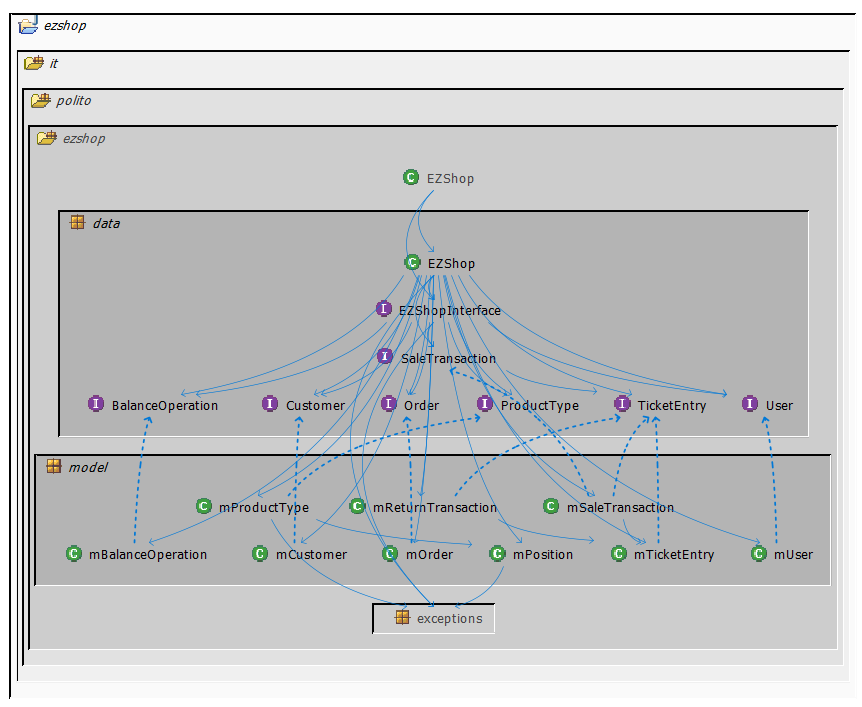
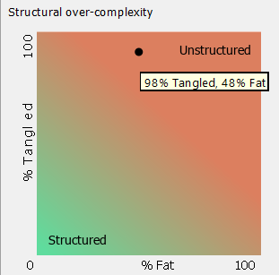
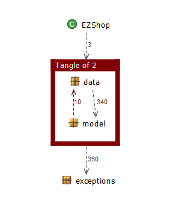

# Design assessment
```
<The goal of this document is to analyse the structure of your project, compare it with the design delivered
on April 30, discuss whether the design could be improved>
```

# Levelized structure map
 

# Structural over complexity chart
 

# Size metrics
| Metric                                    | Measure |
| ----------------------------------------- | ------- |
| Packages                                  | 6       |
| Classes (outer)                           | 38      |
| Classes (all)                             | 38      |
| NI (number of bytecode instructions)      | 12 K    |
| LOC (non comment non blank lines of code) | ~ 5 K   |


# Items with XS
| Item                                                         | Tangled | Fat  | Size   | XS    |
| ------------------------------------------------------------ | ------- | ---- | ------ | ----- |
| ezshop.it.polito.ezshop.data.EZShop                          |         | 215  | 5,695  | 2,516 |
| ezshop.it.polito.ezshop.data.EZShop.EZShop():void            |         | 88   | 889    | 737   |
| ezshop.it.polito.ezshop                                      | 1%      | 5    | 11,794 | 167   |
| ezshop.it.polito.ezshop.data.EZShop.modifyCustomer(Integer, String, String):boolean |         | 21   | 192    | 54    |
| ezshop.it.polito.ezshop.model.mReturnTransaction.insert():boolean |         | 20   | 177    | 44    |
| ezshop.it.polito.ezshop.model.mSaleTransaction.insert():boolean |         | 20   | 171    | 42    |
| ezshop.it.polito.ezshop.model.mOrder.update(String, int, double, String, Integer):boolean |         | 19   | 187    | 39    |
| ezshop.it.polito.ezshop.model.mProductType.update(Integer, it.polito.ezshop.model.mPosition, String, String, String, double):boolean |         | 19   | 182    | 38    |
| ezshop.it.polito.ezshop.model.mSaleTransaction.update(double, Integer, double):boolean |         | 19   | 152    | 32    |
| ezshop.it.polito.ezshop.model.mUser.update(String, String, String):boolean |         | 18   | 157    | 26    |


# Package level tangles
 

# Summary analysis
With respect to the April 30 design, we added some dependencies between model and data packages; some classes have been completely deleted because we noticed that they could be easily incorporated in other classes; some methods were removed and others were added because we noticed that some were useful or repeated while others not. Plus we noticed that more classes were actually persistent in the database and added a connection to the db in them.

The weaknesses in our current design mainly regard the fact that some methods of ezshop could be put in dedicated and specific classes or methods in order to slim some of our code. Also there still are duplicated lines in many points of our code that could be gathered in small dedicated methods.
