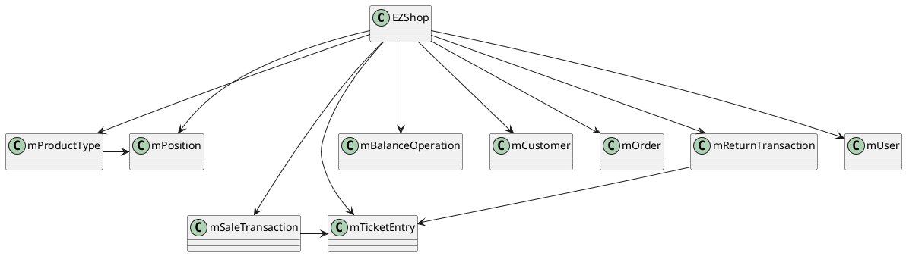
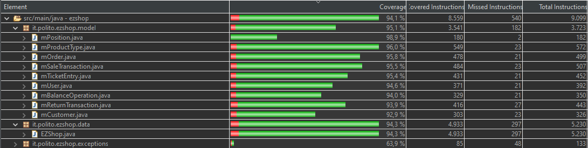
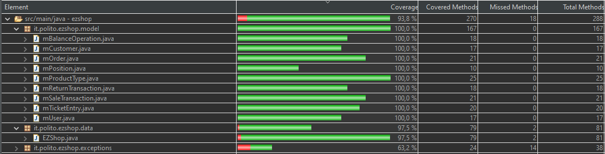
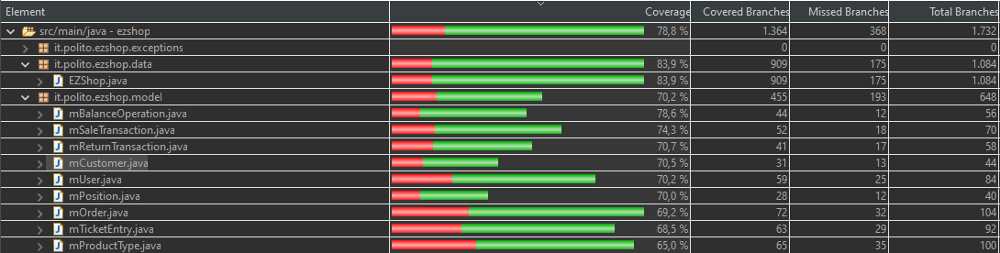

# Integration and API Test Documentation

Authors: Semeraro Lorenzo, Ernesto Cristian, Marino Vincenzo, Matees Mihai Alexandru

Date: 26/05/2021

Version: 1.0

# Contents

- [Dependency graph](#dependency graph)
  
- [Integration and API Test Documentation](#integration-and-api-test-documentation)
- [Contents](#contents)
- [Dependency graph](#dependency-graph)
- [Integration approach](#integration-approach)
- [Tests](#tests)
  - [Step 1](#step-1)
  - [Step 2](#step-2)
  - [Step n](#step-n)
- [Scenarios](#scenarios)
  - [Scenario UCx.y](#scenario-ucxy)
- [Coverage of Scenarios and FR](#coverage-of-scenarios-and-fr)
- [Coverage of Non Functional Requirements](#coverage-of-non-functional-requirements)

- [Tests](#tests)

- [Coverage of scenarios and FR](#scenario-coverage)
- [Coverage of non-functional requirements](#nfr-coverage)
- [Final Code Coverage](#final-code-coverage)
  - [Instructions](#instructions)
  - [Methods](#methods)
  - [Branches](#branches)

# Dependency graph

# Integration approach

    BOTTOM UP

#  Tests

<define below a table for each integration step. For each integration step report the group of classes under test, and the names of
JUnit test cases applied to them> JUnit test classes should be here src/test/java/it/polito/ezshop

## Step 1
| Classes  | JUnit test cases |
|--|--|
| mBalanceOperationTest.java | * |
| mUserTest.java | * |
| mPositionTest.java | * |
| mCustomerTest.java | * |
| mOrderTest.java | * |
| setLocationTest.java | * |
| barcodeValidatorTest.java | * |
| checkCreditCardValidityTest.java | * |
| checkPositionTest.java | * |
| computeChangeTest.java | * |
| isNumericTest.java | * |
| getReturnTransactionTest.java | * |
| attemptPaymentTest.java | * |
| attemptRefundTest.java | * |

## Step 2
| Classes  | JUnit test cases |
|--|--|
|mProductTypeTest.java| * |
|mReturnTransactionTest.java| * |
|mSaleTransactionTest.java| * |
|mTicketEntryTest.java| * |
|addProductToSaleTest.java | * |
|applyDiscountRateToProductTest.java  | * |
| applyDiscountRateToSaleTest.java | * |
| attachCardToCustomerTest.java | * |
| computeBalanceTest.java | * |
| computePointsForSaleTest.java | * |
| createCardTest.java | * |
| defineCustomerTest.java  | * |
| deleteCustomerTest.java | * |
| deleteProductFromSaleTest.java | * |
| deleteProductTypeTest.java | * |
| deleteReturnTransactionTest.java | * |
| deleteSaleTransactionTest.java| * |
| deleteUserTest.java | * |
| endReturnTransactionTest.java | * |
| endSaleTransactionTest.java | * |
| getAllCustomerTest.java | * |
| getAllOrdersTest.java | * |
| getAllProductTypesTest.java | * |
| getAllUserTest.java | * |
|createUserTest.java| * |
|loginTest.java| * |
|createProductTypeTest.java| * |
|updatePositionTest.java| * |
|getProductTypeByBarcodeTest.java| * |
|mProductTypeTest.java| * |
|getCreditsAndDebitsTest.java| * |
|getCustomerTest.java| * |
|getProductTypeByBarCodeTest.java| * |
|getProductTypesByDescriptionTest.java| * |
|getSaleTransactionTest.java| * |
|getUserTest.java| * |
|issueOrderTest.java| * |
|loginTest.java| * |
|logoutTest.java| * |
|modifyCustomerTest.java| * |
|modifyPointsOnCardTest.java| * |
|payOrderFor.java| * |
|payOrderTest.java| * |
|receiveCashPayment.java| * |
|receiveCreditCardPaymentTest.java| * |
|recordBalanceUpdateTest.java| * |
|recordOrderArrivalTest.java| * |
|resetTest.java| * |
|returnCashPaymentTest.java| * |
|returnCreditCardPaymentTest.java| * |
|returnProductTest.java| * |
|startReturnTransactionTest.java| * |
|startSaleTransactionTest.java| * |
|updateProductTest.java| * |
|updateQuantityTest.java| * |
|upgradeUserRightsTest.java| * |

## Step 3

| Classes  | JUnit test cases |
|--|--|
|manageProductsTest.java|scenario1_1()|
|                       |scenario1_2()|
|manageUserAndRightsTest.java| scenario2_1() |
|                        | scenario2_2()|
|                         | scenario2_3() |
|manageInventoryAndOrders.java| scenario3_1() |
|                             | scenario3_2()  |
|                             | scenario3_3()  |
| manageCustomersAndCardsTest.java| scenario4_1() |
|                             | scenario4_2()  |
|                             | scenario4_3()  |
| authenticateTest.java        | scenario5_1() |
|                             | scenario5_2() |
| manageSaleTransactionTest.java | scenario6_1() |
|                             | scenario6_2() |
|                             | scenario6_3() |
|                             | scenario6_4() |
|                             | scenario6_5() |
|                             | scenario6_6() |
|ManagePaymentTest.java| scenario7_1() |
|                      | scenario7_2() |
|                      | scenario7_3() |
|                      | scenario7_4() |
|ManageReturnTransactionTest.java| scenario8_1() |
|                                | scenario8_2() |
|AccountingTest.java  | scenario9_1()  |
|ManageReturnTest.java| scenario10_1() |
|                     | scenario10_2() |

# Scenarios

<If needed, define here additional scenarios for the application. Scenarios should be named
 referring the UC in the OfficialRequirements that they detail>

## Scenario UCx.y

| Scenario |  name |
| ------------- |:-------------:|
|  Precondition     |  |
|  Post condition     |   |
| Step#        | Description  |
|  1     |  ... |
|  2     |  ... |

# Coverage of Scenarios and FR

<Report in the following table the coverage of  scenarios (from official requirements and from above) vs FR.
Report also for each of the scenarios the (one or more) API JUnit tests that cover it. >

| Scenario ID | Functional Requirements covered | JUnit  Test(s) |
| ----------- | ------------------------------- | ----------- |
|  1-1         | FR3.1                            | class: manageProductsTest method: scenario1_1() |
|  1-2        | FR3.4, FR4.2                          | class: manageProductsTest method: scenario1_2() |
| 1-3         |   FR3.1, FR3.4                 | class: manageProductsTest method: scenario1_3() |
| 2-1         |   FR1.1                               |  class: manageUserAndRightsTest method: scenario2_1()  |
|  2-2        |       FR1.2, FR1.4                   | class: manageUserAndRightsTest method: scenario2_2() |
| 2-3         |     FR1.4, FR1.5              | class: manageUserAndRightsTest method: scenario2_3() |
| 3-1 | FR4.3 | class: manageInventoryAndOrders method: scenario3_1()    |
| 3-2 | FR4.5 | class: manageInventoryAndOrders method: scenario3_2() |
| 3-3 | FR4.3, FR4.5, FR4.6 | class: manageUserAndRightsTest method: scenario3_3() |
| 4-1        | FR5.1                 |      class: manageCustomersAndCardsTest method: scenario4_1()      |
| 4-2        | FR5.5, FR5.6   | class: manageCustomersAndCardsTest method: scenario4_2() |
| 4-3        | FR5.1, FR5.3        | class: manageCustomersAndCardsTest method: scenario4_3() |
| 4-4      | FR5.1, FR5.3 | class: manageCustomersAndCardsTest method: scenario4_4() |
| 5-1      | FR1.5      | class: authenticateTest method: scenario5_1() |
| 5.2 | FR1.4, FR1.5 | class: authenticateTest method: scenario5_2() |
| 6-1 | FR6.1, FR6.7, FR6.2, FR4.1, FR6.10, FR7.1, FR7.2, FR8.2, FR6.11, FR6.8,  FR8.4 | class: manageSaleTest method: scenario6_1() |
| 6-2 | R6.1, FR6.7, FR6.5, FR6.2, FR4.1, FR6.5,  FR6.10, FR7.1, FR7.2, FR8.2, FR6.11, FR6.8,  FR8.4 | class: manageSaleTest method: scenario6_2() |
| 6-3 | R6.1, FR6.7, FR6.4, FR6.2, FR4.1, FR6.4, FR6.10, FR7.1, FR7.2, FR8.2, FR6.11, FR6.8,  FR8.4 | class: manageSaleTest method: scenario6_3() |
| 6-4 | FR6.1, FR6.7, FR6.2, FR4.1, FR6.10, FR7.2, FR8.2, FR6.11, FR5.7, FR6.11, FR6.8,  FR8.4 | class: manageSaleTest method: scenario6_4() |
| 6-5 | FR6.1, FR6.7, FR6.2, FR4.1, FR6.10, FR6.11,                  | class: manageSaleTest method: scenario6_5() |
| 6-6 | FR6.1, FR6.7, FR6.2, FR4.1, FR6.10, FR7.1, FR8.2, FR6.11, FR6.8,  FR8.4 | class: manageSaleTest method: scenario6_6() |
| 7-1 |  FR7.2, FR8.2 | class: managePaymentsTest method: Scenario7_1()  |
| 7-2 |  FR7.2 | class: managePaymentsTest method: Scenario7_2() |
| 7-3 |  FR7.2 | class: managePaymentsTest method: Scenario7_3() |
| 7-4 |  FR7.1, FR8.2 | class: managePaymentsTest method: Scenario7_4() |
| 8-1 | FR6.12, FR6.13, FR4.1, FR6.14, FR6.15, FR7.4, FR8.1, FR8.4 | class: manageReturnTransactionTest method: scenario8_1()  |
| 8-2 | FR6.12, FR6.13, FR4.1, FR6.14, FR6.15, FR7.3, FR8.1, FR8.4 | class: manageReturnTransactionTest method: scenario8_2() |
| 9-1 |  FR8.3 | class: accountingTest method: scenario9_1()  |
| 10-1 | FR7.4, FR8.4 | class: manageReturnTest method: scenario10_1()|
| 10-2 | FR7.3, FR8.4  | class: manageReturnTest method: scenario10_2()|

# Coverage of Non Functional Requirements

<Report in the following table the coverage of the Non Functional Requirements of the application - only those that can be tested with automated testing frameworks.>

| Non Functional Requirement | Test name |
| -------------------------- | --------- |
|      NFR4                      |  class: barcodeValidatorTest method: testCorrectBarcode(),testCorrectBarcode13(),testCorrectBarcode14()       |
|      NFR5                      |  class: checkCreditCardValidity method: testCorrectCreditCard()        |
|      NFR6                      |  class: createCardTest method: testCorrect()        |

# Final Code Coverage

### Instructions

### Methods

### Branches

