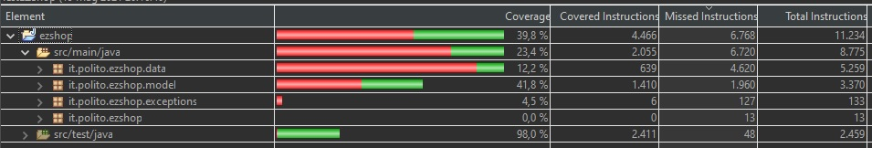

# Unit Testing Documentation

Authors: Semeraro Lorenzo, Ernesto Cristian, Marino Vincenzo, Matees Mihai Alexandru

Date: 18/05/2021

Version: 1.1

# Contents

- [Black Box Unit Tests](#black-box-unit-tests)

- [White Box Unit Tests](#white-box-unit-tests)

# Black Box Unit Tests

    <Define here criteria, predicates and the combination of predicates for each function of each class.
    Define test cases to cover all equivalence classes and boundary conditions.
    In the table, report the description of the black box test case and (traceability) the correspondence with the JUnit test case writing the 
    class and method name that contains the test case>
    <JUnit test classes must be in src/test/java/it/polito/ezshop   You find here, and you can use,  class TestEzShops.java that is executed  
    to start tests
    >

### **Class *EZShop.java* - method *barcodeValidator***

**Criteria for method *barcodeValidator*:**

- Validity of the string parameter
- Length of the string
- Validity of barcode

**Predicates for method *barcodeValidator*:**

| Criteria | Predicate |
| -------- | --------- |
|  Validity of the string parameter        |     Valid       |
|          |   NULL        |
|  Length of the string        |  12 <= length <= 14        |
|          |    length < 12         |
|          | length > 14 |
|  Validity of barcode       |  Yes      |
|          |    No       |

**Boundaries for method *barcodeValidator*:**:

| Criteria | Boundary values |
| -------- | --------------- |
| ...         |     ...            |

**Combination of predicates *barcodeValidator*:**:

| Validity of the string parameter | Length of the string | Validity of barcode | Valid / Invalid | Description of the test case | JUnit test case |
|-------|-------|-------|-------|-------|-------|
|Valid|12 <= length <= 14 |Yes|Valid|T0(333333333331) -> true|testCorrectBarcode()|
|*|*|No|Invalid|T1(333333333333) -> false|testInvalidBarcode()|
|*|length < 12 |-|Invalid|T2(0123) -> false |testInvalidBarcodeOutOfBoundaries1()|
|*| length > 14 |- | Invalid | T3(012390192301301831088) | testInvalidBarcodeOutOfBoundaries2()|
|NULL|-|-|Invalid|T3(NULL;error)|testNullBarcode()|

### **Class *EZShop.java* - method *checkCreditCardValidity***

**Criteria for method *checkCreditCardValidity*:**

- Validity of the string parameter
- Validity of creditcard
- Validity of the format

**Predicates for method *checkCreditCardValidity*:**

| Criteria | Predicate |
| -------- | --------- |
| Validity of the string parameter         |    Valid       |
|          |        NULL   |
| Validity of creditcard         |   Yes        |
|          |     No      |
| Validity of the format        |   Only numbers       |
|          |     Numbers+chars     |

**Boundaries for method *checkCreditCardValidity*:**:

| Criteria | Boundary values |
| -------- | --------------- |
|    ...      |  ...               |
|          |                 |

**Combination of predicates for method *checkCreditCardValidity*:**:

| Validity of the string parameter | Validity of creditcard | Validity of the format | Valid / Invalid | Description of the test case | JUnit test case |
|-------|-------|-------|-------|-------|-------|
|Valid|Yes|Only Numbers|Valid|T0(4733750149246197) -> true|testCorrectCreditCard()|
|*|No|*|Invalid|T1(0000123456789125) -> false|testInvalidCreditCard()|
|*|-|Numbers+chars|Invalid|T2(000012345678aaaa) -> false|testInvalidCreditCardOutOfBoundaries()|
|NULL|-|-|Invalid|T3(NULL;error)|testNullCreditCard()|

### **Class *EZShop.java* - method *computeChange***

**Criteria for method *computeChange*:**

- Validity of double parameter
- Sign of cash
- Sign of cost

**Predicates for method *computeChange*:**

| Criteria | Predicate |
| -------- | --------- |
|  Validity of double parameter        |   Valid        |
|          |     Null      |
|    Sign of cash      |  [0;maxdouble]         |
|          |       [mindouble;0]    |
|    Sign of cost      |  [0;cash]         |
|          |       [mindouble;0]    |
|          |       [cash;maxdouble]    |

**Boundaries**:

| Criteria | Boundary values |
| -------- | --------------- |
|  Compute change        |        (cash-cost) >=0        |

**Combination of predicates**:

| Sign of cash | Sign of cost | Valid / Invalid | Description of the test case | JUnit test case |
|-------|-------|-------|-------|-------|
|[0;maxdouble]|[0;cash]|Valid|T0(10,5) -> 5|testCorrectChange|
|*|[cash;maxdouble]|Invalid|T1(10,20) -> error|testInvalidCost1|
|*|[mindouble;0]|Invalid|T2(10,-1) -> error|testInvalidCost2|
|[mindouble;0]|-|Invalid|T3(-5,2) -> error|testInvalidCash|

### **Class *EZShop.java* - method *checkPosition***

**Criteria for method *checkPosition*:**

- Validity of String parameter
- Validity of position

**Predicates for method *checkPosition*:**

| Criteria | Predicate |
| -------- | --------- |
| Validity of String parameter         |      Valid     |
|          |         NULL  |
| Validity of position format        |     Yes      |
|          |      No     |
| Availability of position         |     Yes      |
|          |      No     |

**Boundaries**:

| Criteria | Boundary values |
| -------- | --------------- |
|  ...        |  ...        |

**Combination of predicates**:

| Validity of String parameter | Validity of position format| Availability of position | Valid / Invalid | Description of the test case | JUnit test case |
|-------|-------|-------|-------|-------|-------|
|Valid|Yes|Yes|Valid|T0(p1=(1-1-1))   prod.setLocation(p)   inventory.put(1,prod)    -> true|testCorrectPosition|
|*|*|No|Invalid|T1(p2=(1-1-1))   prod2.setLocation(p2)   inventory.put(2,prod2)   -> false|testNotAvaiability|
|*|No|-|Invalid|T2(aaa) -> error|testInvalidPosition|
|NULL|-|-|Invalid|T3(NULL) -> error|testNullPosition|

### **Class *EZShop.java* - method *isNumeric***

**Criteria for method *isNumeric*:**

- Validity of the string parameter
- String represents a number

**Predicates for method *isNumeric*:**

| Criteria | Predicate |
| -------- | --------- |
| Validity of the string parameter         |      Valid     |
|          |      NULL     |
|   String represents a number       |    Yes       |
|          |     No      |

**Boundaries**:

| Criteria | Boundary values |
| -------- | --------------- |
|   ...       |      ...           |

**Combination of predicates**:

| Validity of the string parameter | String represents a number  |  Valid / Invalid | Description of the test case | JUnit test case |
|-------|-------|-------|-------|-------|
|Valid|Yes|Valid|T0("32")->true|testCorrectIsANumber()|
|*|No|Invalid|T1("aa") -> false|testIsNotANumber()|
|NULL|-|Invalid|T2(null) -> false|testNullNumber()|

### **Class *EZShop.java* - method *attemptPayment***

**Criteria for method *attemptPayment*:**

- Validity of the credit card parameter
- Validity of the credit card format
- Positiveness of the cost parameter
- Credit greater than cost
- Existence of the credit card

**Predicates for method *isNumeric*:**

| Criteria | Predicate |
| -------- | --------- |
| Validity of the credit card parameter         |      Valid     |
|          |      NULL     |
|   Validity of the credit card format             |        Yes     |
|          |     No        |
|   Positiveness of the cost parameter            |        Yes     |
|          |     No        |
|   Credit greater than cost format             |        Yes     |
|          |     No        |
|   Existence of the credit card  format             |        Yes     |
|          |     No        |

**Boundaries**:

| Criteria | Boundary values |
| -------- | --------------- |
|   ...       |      ...           |

**Combination of predicates**:

| Validity of the string parameter | Validity of the credit card format  |  Positiveness of the cost parameter | Credit greater than cost  | Existence of the credit card| Description of the test case  |  JUnit test case |
|-------|-------|-------|-------|-------|-------|-------|
|Valid|Yes|Yes|Yes|Yes|T0("4716258050958645",1.0 )->true|testCorrectParameters()|
|*|No|Yes|*|*|T0("0000123456789125",1.0 )->false|testCreditCardNull()|
|*|Yes|No|*|*|T0("4716258050958645",-1.0 )->IllegalArgumentException()|testInvalidCreditCard()|
|Invalid|Yes|Yes|*|*|T0("4716258050958645",-1.0 )->false|testNegativeCost()|
|Valid|*|*|No|*|T0("4716258050958645",500.0 )->false|testInsufficientCredit()|
|Valid|*|*|Yes|No|T0("4716258050958649",1.0 )->false|testNonExistentCreditCard()|

### **Class *EZShop.java* - method *attemptRefund***

**Criteria for method *attemptRefund*:**

- Validity of the credit card parameter
- Validity of the credit card format
- Positiveness of the refund parameter
- Existence of the credit card

**Predicates for method *isNumeric*:**

| Criteria | Predicate |
| -------- | --------- |
| Validity of the credit card parameter         |      Valid     |
|          |      NULL     |
|   Validity of the credit card format             |        Yes     |
|          |     No        |
|   Positiveness of the cost parameter            |        Yes     |
|          |     No        |
|   Existence of the credit card  format             |        Yes     |
|          |     No        |

**Boundaries**:

| Criteria | Boundary values |
| -------- | --------------- |
|   ...       |      ...           |

**Combination of predicates**:

| Validity of the string parameter | Validity of the credit card format  |  Positiveness of the cost parameter | Existence of the credit card| Description of the test case  |  JUnit test case |
|-------|-------|-------|-------|-------|-------|
|Valid|Yes|Yes|Yes|T0("4716258050958645",1.0 )->true|testCorrectParameters()|
|*|No|Yes|*|T0("0000123456789125",1.0 )->false|testCreditCardNull()|
|*|Yes|No|*|T0("4716258050958645",-1.0 )->IllegalArgumentException()|testInvalidCreditCard()|
|Invalid|Yes|Yes|*|T0("4716258050958645",-1.0 )->false|testNegativeRefund()|
|Valid|*|Yes|No|T0("4716258050958649",1.0 )->false|testNonExistentCreditCard()|

### **Class *EZShop.java* - method *getReturnTransaction***

**Criteria for method *getReturnTransaction*:**

- Validity of the Integer parameter
- Validity of the id

**Predicates for method *getReturnTransaction*:**

| Criteria | Predicate |
| -------- | --------- |
| Validity of the Integer parameter         |     Valid      |
|          |   NULL        |
| Validity of the id         |    Yes       |
|          |   No        |

**Boundaries for method *getReturnTransaction*:**:

| Criteria | Boundary values |
| -------- | --------------- |
|          |                 |
|          |                 |

**Combination of predicates for method *getReturnTransaction*:**:

| Validity of the Integer parameter | Validity of the id | Valid / Invalid | Description of the test case | JUnit test case |
|-------|-------|-------|-------|-------|
|Valid|Yes|Valid|T1(id=1) -> returntransaction|testFoundId()|
|*|No|Invalid|T2(id=90) -> error|testMissingId()|
|NULL|-|Invalid|T3(NULL) -> error|testNullId()|

### **Class *mProductType.java* - method *setLocation***

**Criteria for method *setLocation*:**

- Validity of the String parameter

**Predicates for method *setLocation*:**

| Criteria | Predicate |
| -------- | --------- |
| Validity of the String parameter         |     Valid      |
|          |   NULL        |

**Boundaries**:

| Criteria | Boundary values |
| -------- | --------------- |
|          |                 |
|          |                 |

**Combination of predicates**:

| Validity of the string parameter | Valid / Invalid | Description of the test case | JUnit test case |
|-------|-------|-------|-------|
|Valid|Valid|T1(l="1-1-1") -> void|TestSetLocation()|
|Invalid|Invalid|T1(l=null) -> void|TestNullLocation()|

# White Box Unit Tests

### Test cases definition

    <JUnit test classes must be in src/test/java/it/polito/ezshop>
    <Report here all the created JUnit test cases, and the units/classes under test >
    <For traceability write the class and method name that contains the test case>

| Unit name | JUnit test case |
|--|--|
| Class EZShop.java method: attemptPayment | testCorrectParameters() |
||testCreditCardNull()|
||testInvalidCreditCard()|
||testNegativeCost()|
||testInsufficientCredit()|
||testNonExistentCreditCard()|
|Class EZShop.java method: attemptRefund|testCorrectParameters()|
||testCreditCardNull()|
||testInvalidCreditCard()|
||testNegativeRefund()|
||testNonExistentCreditCard()|
|Class EZShop.java method: barcodeValidator|testCorrectBarcode()|
||testCorrectBarcode13()|
||testCorrectBarcode14()|
||testInvalidBarcode()|
||testInvalidBarcodeOutOfBoundaries1()|
||testInvalidBarcodeOutOfBoundaries2()|
||testNullBarcode()|
|Class EZShop.java method: checkCreditCardValidity|testCorrectCreditCard()|
||testOneDigitCreditCard()|
||testInvalidCreditCard()|
||testInvalidCreditCardOutOfBoundaries()|
||testNullCreditCard()|
|Class EZShop.java method: checkPositionTest|testCorrectPosition()|
||testCorrectPosition2items()|
||testEmptyInventory()|
||testNotAvaiability()|
||testInvalidPosition()|
||testNullPosition()|
| Class EZShop.java method: isNumeric            | testCorrectIsANumber|
|                                                | testIsNotANumber()   |
|                                                | testNullNumber()     |
| Class EZShop.java method: getReturnTransaction | testFoundId()        |
|  | testFoundId2items() |
|  | testEmptyReturns() |
|                                                | testMissingId()      |
|                                                | testInvalidId()      |
|                                                | testNullId()         |
| Class EZShop.java method: computeChangeTest    | testCorrectChange()  |
|                                                | testInvalidCost1()   |
|                                                | testInvalidCost2()   |
|                                                | testInvalidCash()   |
|Class mBalanceOperation.java  |getBalanceIdTest()|
||setBalanceIdTest()|
||getDateTest()|
||setDateTest()|
||getMoneyTest()|
||setMoneyTest()|
||getTypeTest()|
||setTypeTest()|
| Class mCustomer.java  | getCustomerNameTest() |
||setCustomerNameTest()|
||getCustomerCardTest()|
||setCustomerCardTest()|
||getIdTest()|
||setIdTest()|
||getPointsTest()|
||setPointsTest()|
| Class mOrder.java  | getBalanceIdTest() |
||setBalanceIdTest()|
||getProductCodeTest()|
||setProductCodeTest()|
||getPricePerUnitTest()|
||setPricePerUnitTest()|
||getQuantityTest()|
||setQuantityTest()|
||getStatusTest()|
||setStatusTest()|
||getOrderIdTest()|
||setOrderIdTest()|
| Class  mProductType.java  | getQuantityTest()           |
|                                             | setQuantityTest()           |
|                                             | getNoteTest()               |
|                                             | setNoteTest()               |
|                                             | getProductDescriptionTest() |
|                                             | setProductDescriptionTest() |
|                                             | getBarCodeTest()            |
|                                             | setBarCodeTest()            |
|                                             | getPricePerUnitTest()       |
|                                             | setPricePerUnitTest()       |
|                                             | getIdTest()                 |
|                                             | setIdTest()                 |
|                                             | getPositionTest()           |
| Class mReturnTransaction.java | getBalanceIdTest()          |
|                                             | setBalanceIdTest()          |
|                                             | getEntriesTest()            |
|                                             | getPriceTest()              |
|                                             | getReturnIdTest()           |
|                                             | getSaleIdTest()             |
|                                             | addEntries()                |
|    Class  mSaleTransaction.java              | getBalanceIdTest()          |
|                                             | getTicketNumberTest()       |
|                                             | setTicketNumberTest()       |
|                                             | getEntriesTest()            |
|                                             | setEntriesTest()            |
|                                             | getDiscountRateTest()       |
|                                             | setDiscountRateTest()       |
|                                             | getPriceTest()              |
|                                             | setPriceTest()              |
|                                             | addEntriesTest()            |
|                                             | removeEntriesTest()         |
| Class  mTicketEntry.java  | setQuantityTest()           |
|                                             | getQuantityTest()           |
|                                             | getProductDescriptionTest() |
|                                             | setProductDescriptionTest() |
|                                             | getBarCodeTest()            |
|                                             | setBarCodeTest()            |
|                                             | getPricePerUnitTest()       |
|                                             | setPricePerUnitTest()       |
|                                             | getDiscountRateTest()       |
|                                             | setDiscountRateTest()       |
| Class  mUser.java         | getIdTest()                 |
|                                             | setIdTest()                 |
|                                             | getUsernameTest()           |
|                                             | setUsernameTest()           |
|                                             | getPasswordTest()           |
|                                             | setPasswordTest()           |
|                                             | getRoleTest()               |
|                                             | setRoleTest()               |
| Class EZShop.java method: setLocationTest   | testNullLocation()          |
|                                             | testSetLocation()           |

### Code coverage report

    <Add here the screenshot report of the statement and branch coverage obtained using
    the Eclemma tool. >

### Loop coverage analysis

    <Identify significant loops in the units and reports the test cases
    developed to cover zero, one or multiple iterations >

|Unit name | Loop rows | Number of iterations | JUnit test case |
|---|---|---|---|
|Class EZShop.java method: barcodeValidator|1157-1163|11|testCorrectBarcode()|
||1157-1163|12|testCorrectBarcode13()|
||1157-1163|13|testCorrectBarcode14()|
|Class EZShop.java method: checkCreditCardValidity|1189-1199|1|testOneDigitCreditCard()|
||1189-1199|16|testCorrectCreditCard()|
|Class EZShop.java method: checkPosition|1175-1179|0|testEmptyInventory()|
||1175-1179|1|testCorrectPosition()|
||1175-1179|2|testCorrectPosition2items()|
|Class EZShop.java method: getReturnTransaction|1229-1238|0|testEmptyReturns()|
||1229-1238|1|testFoundId()|
||1229-1238|2|testFoundId2items()|

